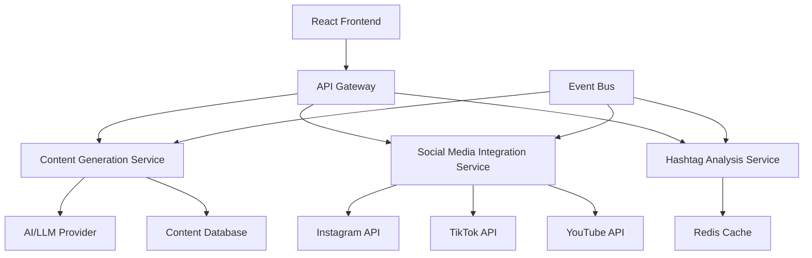

# Design Specification: Content Generation Platform

## 1. Technical Summary
Event-driven microservices platform with React frontend, AI content generation service, social media API integration service, and real-time hashtag analysis.

## 2. Architecture Diagram


## 3. Layer Breakdown
- **UI Layer**: React form components, content display, hashtag suggestions
- **API Layer**: Express.js gateway with rate limiting and authentication
- **Service Layer**: Content generation, social media integration, hashtag analysis
- **Data Layer**: PostgreSQL for content storage, Redis for API caching

## 4. Business Logic and Data Flow
**Happy Path**: User submits intake form → Content service generates text → Hashtag service fetches trending data → Combined response returned
**Alternative Path**: API rate limit hit → Serve cached hashtag data
**Exception Handling**: API failures trigger fallback responses, content generation retries with simplified prompts

## 5. Layer-Specific Design
### 5.1. File Manifest
- **Create**: intake-form.tsx, content-generator.service.ts, hashtag-analyzer.service.ts, social-api.service.ts
- **Create**: api-gateway.ts, content.controller.ts, database.schema.sql
- **Create**: docker-compose.yml, .env.example

### 5.2. Public Interfaces and Types
```typescript
/** Content generation request interface */
interface ContentRequest {
  brandName: string;
  topic: string;
  tone: 'professional' | 'fun' | 'inspirational';
  platform: 'youtube' | 'instagram' | 'tiktok';
  contentType: 'caption' | 'post' | 'script';
}

/** Generated content response interface */
interface ContentResponse {
  content: string;
  hashtags: HashtagSuggestion[];
  segmentationSuggestions?: string[];
}

/** Hashtag suggestion with metrics */
interface HashtagSuggestion {
  tag: string;
  usageCount: number;
  engagementRate: number;
  trendDirection: 'up' | 'down' | 'stable';
}
```

### 5.3. Public Functions
```typescript
/** Generates content based on user input */
async function generateContent(request: ContentRequest): Promise<ContentResponse>

/** Fetches trending hashtags for topic and platform */
async function getTrendingHashtags(topic: string, platform: string): Promise<HashtagSuggestion[]>

/** Analyzes content length and suggests segmentation */
async function analyzeContentLength(content: string, platform: string): Promise<string[]>
```

### 5.4. Refactor Cascade
New microservices architecture requires API gateway setup, service discovery configuration, and event bus implementation.

## 6. Configuration Changes
- **Environment Variables**: Social media API keys, AI provider credentials, Redis connection
- **Docker Configuration**: Multi-service container orchestration
- **API Rate Limits**: Platform-specific throttling rules

## 7. New Dependencies
- Express.js, React, TypeScript
- Redis, PostgreSQL
- Social media SDKs (Instagram Basic Display, TikTok Business, YouTube Data API)
- AI/LLM integration (OpenAI/Anthropic)

## 8. ADR Links
- [20240223-R-001: Content Platform Architecture](20240223-R-001-content-platform-architecture.md)